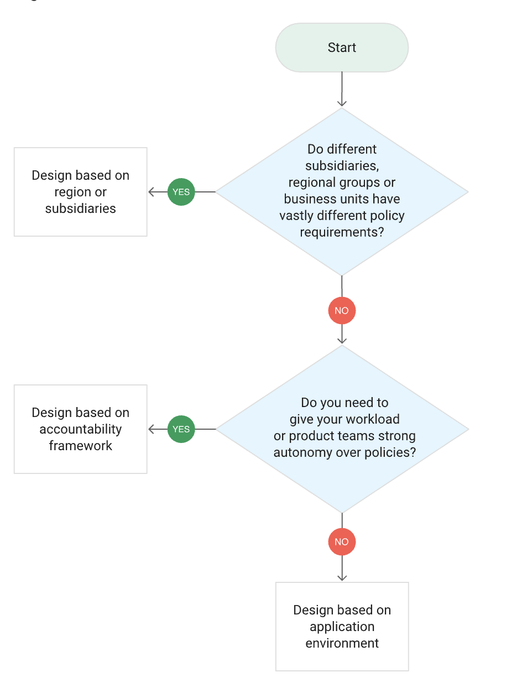
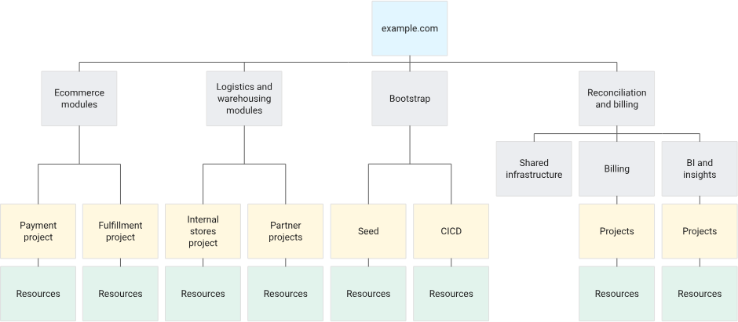
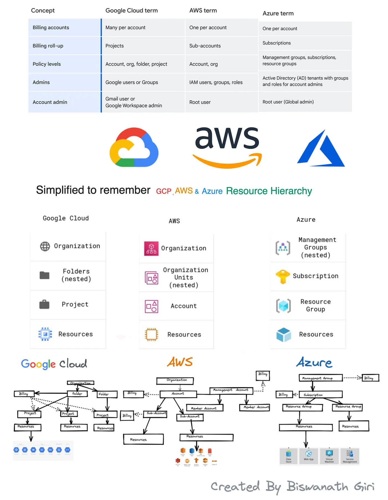
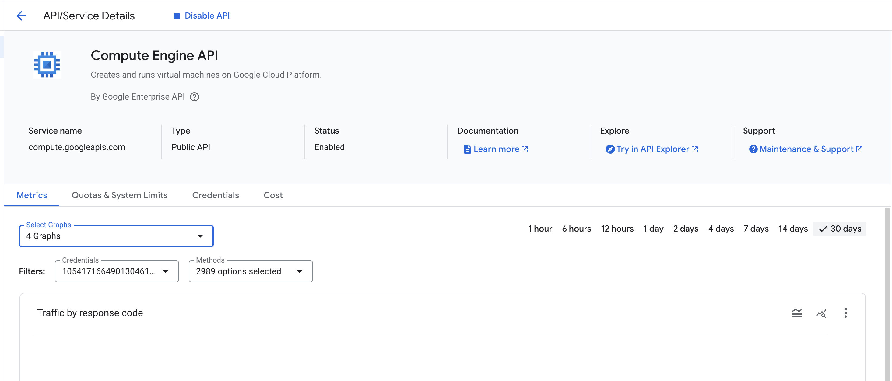
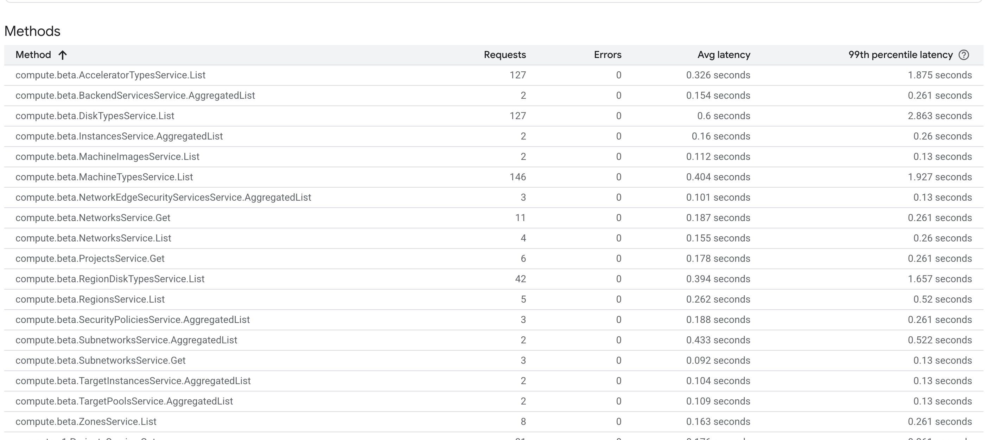

# GCP Overview and Account Setup

Google Cloud provides container resources such as organizations, folders, and projects to group and hierarchically manage cloud resources.

The Resource Manager API is used to programmatically manage these resources.

## Decide a Resource Hierarchy
> Source: [Google Cloud - Decide resource hierarchy](https://cloud.google.com/architecture/landing-zones/decide-resource-hierarchy)

A resource hierarchy is a tree structure that helps organize your Google Cloud resources. It consists of the following levels:

- **Organization**: The root node in the hierarchy, representing your company or organization. It is usually associated with a domain name (e.g., `example.com`).
- **Folder**: A container for organizing projects. You can use folders to group projects by department, team, or any other logical grouping.
- **Project**: The base-level container for all Google Cloud resources. Projects are used to organize resources, manage billing, and manage permissions. Each project has a unique project ID and can contain multiple resources (e.g., Compute Engine instances, Cloud Storage buckets).
- **Resource**: The individual components that make up your Google Cloud environment. Resources can include virtual machines, databases, storage buckets, and more.

The following flowchart shows some elements to consider when designing a resource hierarchy:



Some examples could be:

Hierarchy based on an accountability framework:



## Comparison with AWS and Azure
> Source: [Medium - GCP, AWS, Azure cloud resource hierarchies and billing management simplified guide](https://bgiri-gcloud.medium.com/gcp-aws-azure-cloud-resource-hierarchies-and-billing-management-simplified-guide-608cf7217106)



**AWS:**

- **Organization (optional)**: Top-level container for managing multiple accounts and enforcing centralized policies.
- **Organizational Unit (OU) (optional)**: Sub-division within an organization for further grouping of accounts.
- **Account**: The core unit for managing resources and billing. You can have multiple accounts within an organization or have them exist independently.
- **Resource**: Individual cloud services like EC2 instances, S3 buckets, etc.

**Azure:**

- **Root Management Group**: The highest level, encompassing all subscriptions within your Azure environment.
- **Management Group**: Containers for organizing subscriptions based on needs (e.g., development, production).
- **Subscription**: A unit for managing resources and billing, similar to an AWS account.
- **Resource Group**: A collection of related Azure resources for a specific project or application.
- **Resource**: Individual cloud services like VMs, storage accounts, etc.

## Hands-on: Google Cloud Console and Cloud Shell

### Google Cloud Console

Services in GCP are organized into categories. To use a service, you usually need to enable its API.

For instance, to create a VM instance, you need to enable the Compute Engine API. This allows you to manage all services related to Compute Engine, such as creating VM instances, managing disks, and so on.

The following image shows the Compute Engine API enabled in the Google Cloud Console:


A key difference from AWS is that in GCP, you must enable the API for each service you intend to use. The console often displays graphs and statistics related to the service, which can be quite informative (see the image below).



Another small difference from AWS is that in GCP, you typically choose the region and zone when creating a resource, rather than setting a default region for the console view.

### Cloud Shell

Cloud Shell is a browser-based command-line tool that provides access to your Google Cloud resources.

**Key Features of Cloud Shell:**
*   **Pre-configured Environment**: Comes with the `gcloud` CLI, `kubectl`, Docker, and other essential development tools pre-installed and authenticated.
*   **Persistent Storage**: Provides 5 GB of persistent disk storage in your `$HOME` directory, so your files and configurations persist between sessions.
*   **Language Support**: Supports various programming languages like Java, Go, Python, Node.js, PHP, and Ruby.
*   **Temporary Compute Engine VM**: Runs on a temporary Compute Engine virtual machine managed by Google.

The `gcloud help` command shows the following:

```bash
$ gcloud help

NAME
    gcloud - manage Google Cloud resources and developer workflow

SYNOPSIS
    gcloud GROUP | COMMAND [--account=ACCOUNT]
        [--billing-project=BILLING_PROJECT] [--configuration=CONFIGURATION]
        [--flags-file=YAML_FILE] [--flatten=[KEY,...]] [--format=FORMAT]
        [--help] [--project=PROJECT_ID] [--quiet, -q]
        [--verbosity=VERBOSITY; default="warning"] [--version, -v] [-h]
        [--access-token-file=ACCESS_TOKEN_FILE]
        [--impersonate-service-account=SERVICE_ACCOUNT_EMAILS] [--log-http]
        [--trace-token=TRACE_TOKEN] [--no-user-output-enabled]

DESCRIPTION
    The gcloud CLI manages authentication, local configuration, developer
    workflow, and interactions with the Google Cloud APIs.

    For a quick introduction to the gcloud CLI, a list of commonly used
    commands, and a look at how these commands are structured, run gcloud
    cheat-sheet or see the `gcloud` CLI cheat sheet
    (https://cloud.google.com/sdk/docs/cheatsheet).
```

The `gcloud` CLI is the primary command-line tool for interacting with Google Cloud Platform (GCP). It allows you to manage your GCP resources and services directly from your terminal. Here's a high-level overview of how it works:

#### Command Structure

`gcloud` commands follow a hierarchical and consistent structure:

```bash
gcloud [RELEASE_TRACK] [GROUP] [SUBGROUP] [COMMAND] [ENTITY] [POSITIONAL_ARGS] [--FLAGS]
```

-   **`gcloud`**: The entry point for all commands.
-   **`RELEASE_TRACK`** (optional): Specifies the release level (e.g., `alpha`, `beta`). If omitted, it defaults to General Availability (GA).
-   **`GROUP`**: Represents a GCP product or service area (e.g., `compute` for Compute Engine, `sql` for Cloud SQL, `iam` for Identity and Access Management).
-   **`SUBGROUP`** (optional): Further categorizes commands within a group (e.g., `instances` within `compute`).
-   **`COMMAND`**: The specific action to perform (e.g., `list`, `create`, `delete`, `describe`, `update`).
-   **`ENTITY`** (optional): The name or ID of the resource you're operating on.
-   **`POSITIONAL_ARGS`**: Required arguments for the command.
-   **`--FLAGS`**: Optional arguments to modify the command's behavior (e.g., `--project=PROJECT_ID`, `--zone=ZONE`, `--format=json`).

**Example:**
To list all Compute Engine instances in a specific project and zone:
```bash
gcloud compute instances list --project=my-gcp-project --zone=us-central1-a
```

