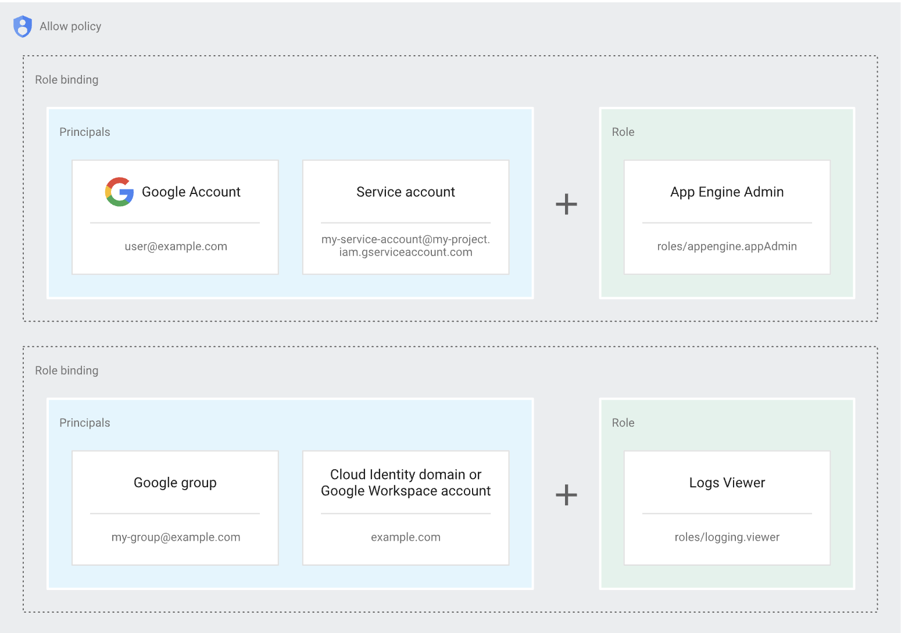
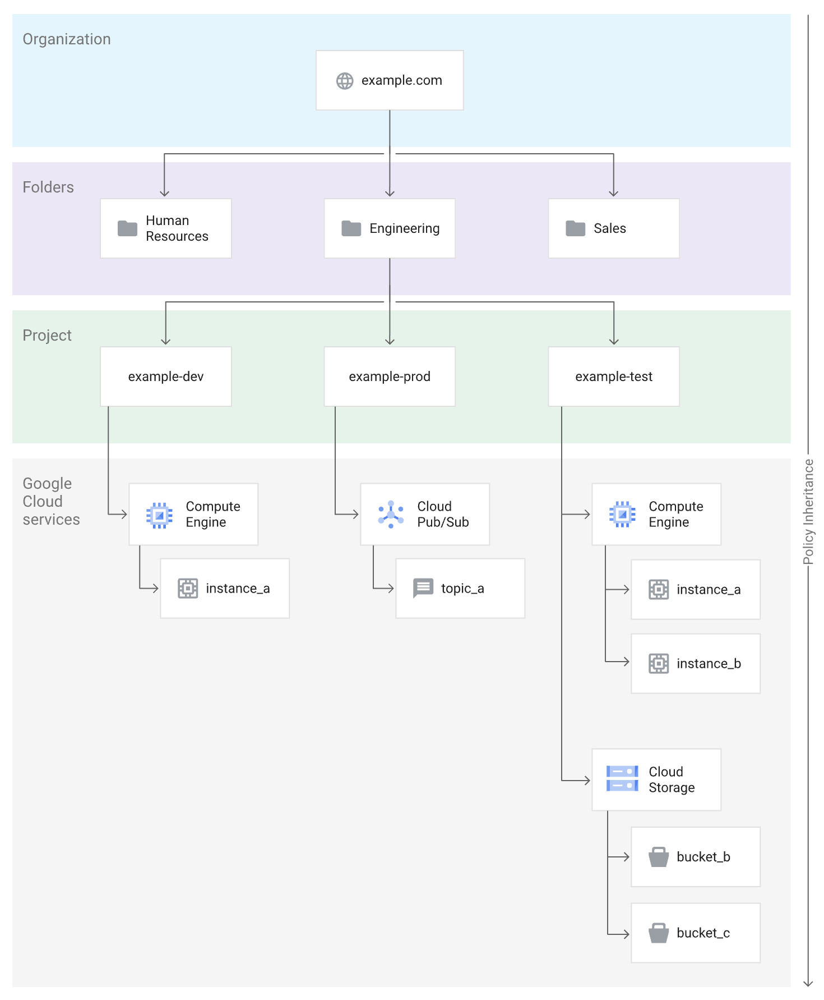

# Identity & Access Management (IAM)

Similar to other cloud providers, every action in Google Cloud requires specific permissions. When you attempt to perform an action—for example, creating a VM instance—IAM first checks whether you possess the necessary permissions to perform that action.

## IAM Concepts

Granting someone permissions in IAM involves the following three components:

- **Principal**: The identity of the entity (e.g., user, service account) to whom you want to grant permissions.
- **Role**: A collection of permissions.
- **Resource**: The Google Cloud resource to which you want to grant access.

### Principals

Principals represent one or more identities that can be granted access.

There are various types of principals in IAM, which can be divided into two broad categories:

- **Human users**: These include Google accounts, Google groups, and federated identities in workforce identity pools.
- **Workloads**: These include service accounts and federated identities in a workload identity pool.

### Permissions and Roles

Permissions determine what actions are allowed on a resource. They are usually represented in the format `service.resource.verb`.

> Permissions often map directly to a specific REST API method. For example, the `resourcemanager.projects.list` permission allows you to use the `projects.list` API method to list Resource Manager projects.

**Permissions cannot be directly assigned to a principal; instead, roles are assigned.**

A role is a collection of permissions.

There are three types of roles:

- **Predefined roles**: Managed by Google Cloud.
- **Custom roles**: Created by users.
- **Basic roles**: Highly permissive roles (Owner, Editor, Viewer) that provide broad access to Google Cloud services. These are suitable for testing but are not recommended for production environments.

### Resources

In IAM, access is granted to resources.

Google Cloud also has several container resources, including projects, folders, and organizations. Granting a principal a role on a container resource gives the principal access to the container resource itself and all resources within that container.
> For example, if you grant a principal the `roles/compute.admin` role on a project, the principal can perform all Compute Engine actions on all resources within that project.

### Allow Policies

Roles are granted to principals using allow policies. An allow policy is a YAML or JSON object attached to a Google Cloud resource.

As shown in the image above, each allow policy contains a list of role bindings that associate IAM roles with the principals who are granted those roles.

### Policy Inheritance

The following diagram illustrates an example of a Google Cloud resource hierarchy:

Policy inheritance has the following implications:

- You can use a single role binding to grant access to multiple resources. If you want to grant a principal access to all resources within a container, assign them a role on the container rather than on individual resources within it.
- You can grant access to resources that do not have their own allow policies. Not all resources accept allow policies, but all resources inherit the allow policies of their parent resources.
- To understand who can access a resource, you must also review all allow policies that affect that resource through inheritance.

### Advanced Access Control

- **Additional policy types**:
    - **Deny policies**: Used to deny access to a resource, even if access is granted by an allow policy. Deny policies override allow policies.
    - **Principal Access Boundary (PAB) policies**: Define the resources to which a principal is eligible to have access.
- **IAM Conditions**: IAM Conditions allow you to define and enforce conditional, attribute-based access control.
- **Privileged Access Manager (PAM)**: With PAM, principals can request and be granted temporary, auditable access to resources.

## Hands-on: IAM

Set up a Workload Identity Pool to authenticate GitHub Actions to GCP.